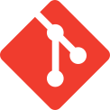

<h1 align="center">Hi there, I'm Mister Pine 🌲</h1> 

 

# My skills

## Languages
&emsp;&ensp;
&emsp;&ensp;
&emsp;&ensp;
&emsp;&ensp;
&emsp;&ensp;
&emsp;&ensp;
&emsp;&ensp;
&emsp;&ensp;
&emsp;&ensp;
&emsp;&ensp;

## Frameworks and other tools
&emsp;&ensp;
&emsp;&ensp;
&emsp;&ensp;
&emsp;&ensp;
&emsp;&ensp;
&emsp;&ensp;
&emsp;&ensp;
&emsp;&ensp;

## Platforms
&emsp;&ensp;
&emsp;&ensp;
&emsp;&ensp;

  

  

<!--
**Mr-Pine/Mr-Pine** is a ✨ _special_ ✨ repository because its `README.md` (this file) appears on your GitHub profile.

Here are some ideas to get you started:

- 🔭 I’m currently working on ...
- 🌱 I’m currently learning ...
- 👯 I’m looking to collaborate on ...
- 🤔 I’m looking for help with ...
- 💬 Ask me about ...
- 📫 How to reach me: ...
- 😄 Pronouns: ...
- ⚡ Fun fact: ...
-->
